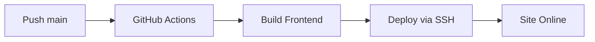

# 🚀 GitHub Actions Workflows

Este diretório contém os workflows de deploy automático do projeto.

## 📋 Workflows Disponíveis

### ✅ `deploy-frontend.yml` - **ATIVO**

Deploy **apenas do frontend** (arquivos estáticos).

**Quando usar**: Agora! O backend ainda não está funcional.

**O que faz**:
1. Build do frontend (Vite)
2. Backup da versão anterior
3. Upload via SSH/SCP
4. Verificação do deploy

**Trigger**: Push na branch `main`

**Secrets necessários**:
- `SSH_HOST`
- `SSH_USERNAME`
- `SSH_PRIVATE_KEY`
- `SSH_PORT`
- `DEPLOY_PATH`
- `VITE_GEMINI_API_KEY` (opcional)

---

### ⏸️ `deploy.yml` - **DESATIVADO (Futuro)**

Deploy **full stack** (frontend + backend).

**Quando usar**: Quando o backend estiver funcional.

**O que faz**:
1. Build do frontend e backend
2. Backup completo
3. Upload de todos os arquivos
4. Instala dependências do backend
5. Reinicia aplicação (PM2/systemd)

**Status**: Atualmente comentado. Será usado no futuro.

---

## 🎯 Como Funciona



### Fluxo Atual (Frontend):

1. Desenvolvedor faz `git push origin main`
2. GitHub Actions detecta o push
3. Workflow `deploy-frontend.yml` é executado
4. Frontend é buildado (Vite)
5. Arquivos são enviados via SSH para CloudPanel
6. Site fica disponível automaticamente

### Fluxo Futuro (Full Stack):

1. Mesmo início do fluxo frontend
2. Backend também é buildado (TypeScript → JavaScript)
3. Dependências são instaladas no servidor
4. PM2 reinicia a aplicação Node.js
5. Frontend + Backend ficam disponíveis

---

## 🔧 Configuração

### CloudPanel (Site Estático - Atual):

```yaml
# Tipo de site no CloudPanel
Site Type: Static HTML

# Nginx root
root: /home/usuario/htdocs/dominio.com/dist
```

### CloudPanel (Site Node.js - Futuro):

```yaml
# Tipo de site no CloudPanel
Site Type: Node.js

# Estrutura
/home/usuario/htdocs/dominio.com/
  ├── dist/        # Frontend
  └── server/      # Backend (PM2)
```

---

## 📝 Para Ativar o Deploy Full Stack (Futuro):

1. Certifique-se de que o backend está funcional
2. Teste localmente: `cd server && npm run dev`
3. Altere o site no CloudPanel de "Static HTML" para "Node.js"
4. Renomeie ou desative `deploy-frontend.yml`
5. O workflow `deploy.yml` será usado automaticamente

---

## 🐛 Troubleshooting

### Deploy falha no step "Build frontend"
- Verifique se `npm run build` funciona localmente
- Verifique se não há erros TypeScript

### Deploy falha no step "Copy files"
- Verifique se secrets estão corretos
- Teste conexão SSH: `ssh -i chave usuario@servidor`

### Site mostra página em branco
- Verifique se `dist/index.html` existe no servidor
- Veja logs: `tail -f ~/logs/nginx_error.log`

---

## 📚 Documentação Completa

- Frontend Only: [../../DEPLOY_FRONTEND_ONLY.md](../../DEPLOY_FRONTEND_ONLY.md)
- Full Stack: [../../DEPLOY_CLOUDPANEL.md](../../DEPLOY_CLOUDPANEL.md)
